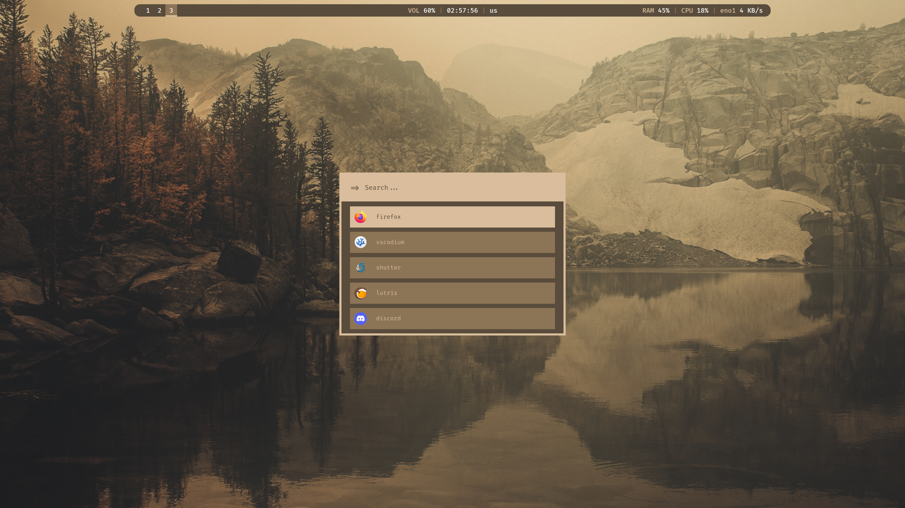
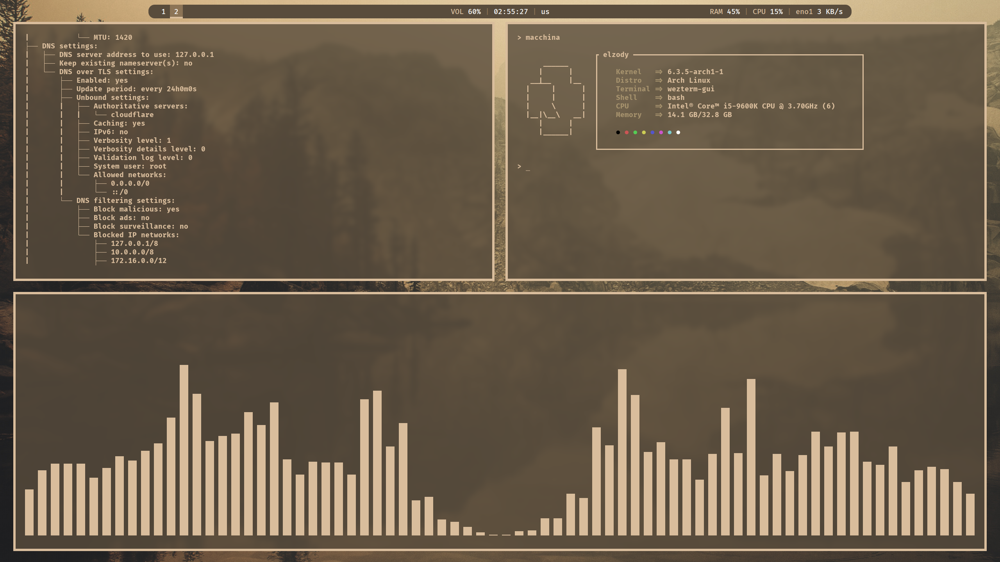

# dotfiles

use the dotfiles as you wish

## screenshots

## the stuff you came for
**distro** => [arch linux](https://archlinux.org/) 
**wm** => [i3](https://i3wm.org/) 
**terminal** => [wezterm](https://wezfurlong.org/wezterm/) 
**app launcher** => [rofi](https://davatorium.github.io/rofi/) 
**status bar** => [polybar](https://polybar.github.io/) 
**wallpaper** => https://whvn.cc/o51q1p
